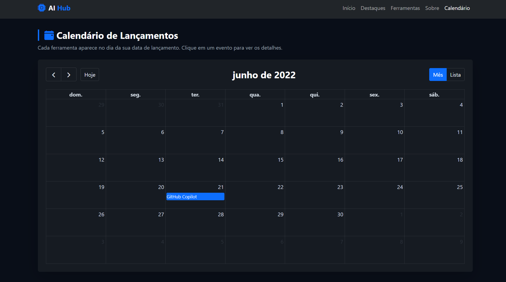
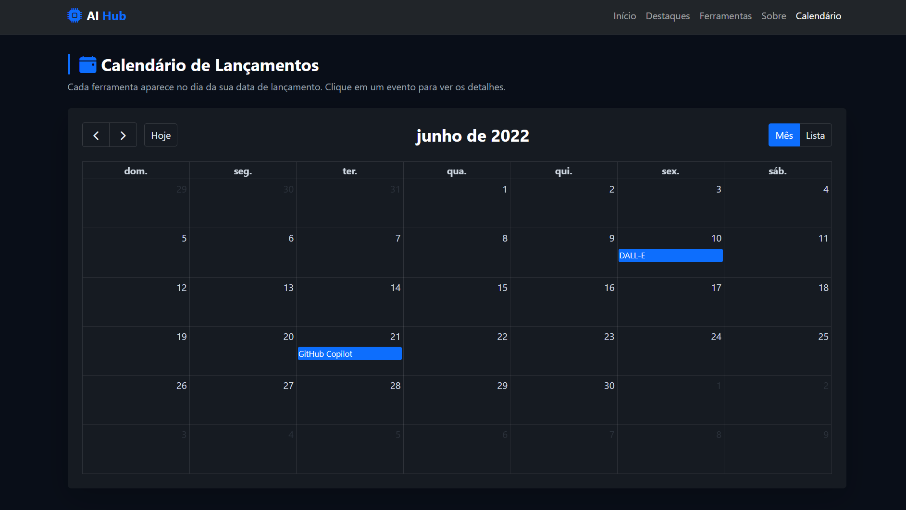
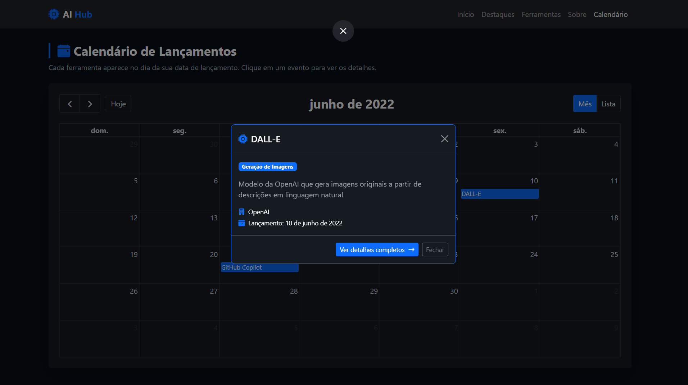

# AI Hub — Ferramentas de Inteligência Artificial

Site sobre as principais ferramentas de Inteligência Artificial (ChatGPT, Claude, Midjourney, GitHub Copilot, Gemini e Sora), desenvolvido com HTML, CSS (Bootstrap 5) e JavaScript. Os dados são servidos por um JSON Server e consumidos via `fetch`.

## Páginas

- **index.html** — página inicial com hero, carrossel de destaques, busca, listagem das ferramentas e seção "Sobre".
- **detalhes.html** — detalhes de uma ferramenta específica (acessada por `?id=`).
- **calendario.html** — calendário interativo com os lançamentos das ferramentas.
- **login.html** — tela de login.
- **cadastro.html** — cadastro de novos usuários.
- **favoritos.html** — lista as ferramentas favoritadas pelo usuário logado.
- **cadastro_itens.html** — cadastro, edição e exclusão de ferramentas (apenas administrador).

## Funcionalidades

- **Login e cadastro de usuários:** os dados ficam na coleção `usuarios` do `db.json`. O usuário logado é guardado no `sessionStorage`. O menu muda conforme o login (mostra "Favoritos" quando logado, alterna "Login"/"Logout" e mostra "Cadastro de itens" apenas para administrador).
- **Busca:** campo na home que filtra as ferramentas por nome ou descrição.
- **Favoritos:** ícone de coração nos cards e na página de detalhes, salvo por usuário no JSON Server.

### Usuários de exemplo

- Administrador → login: `admin` / senha: `admin`
- Usuário comum → login: `francisco` / senha: `123`

## Como rodar o projeto (localhost)

É necessário ter o [Node.js](https://nodejs.org/) instalado.

1. Instale as dependências:

   ```bash
   npm install
   ```

2. Inicie o servidor (JSON Server + arquivos do site):

   ```bash
   npm start
   ```

3. Acesse no navegador:

   - Site: http://localhost:3000/index.html
   - Calendário: http://localhost:3000/calendario.html
   - API (dados): http://localhost:3000/ferramentas

> O JSON Server lê o arquivo `db.json`. Qualquer alteração feita nos dados (adicionar, editar ou remover ferramentas) é refletida automaticamente no site e no calendário ao recarregar a página.

## Apresentação Dinâmica de Dados

**Aluno(a):** Francisco Ronaldo Vasconcelos Araújo — **Matrícula:** 1659978

**Funcionalidade:** Calendário interativo de notícias por data de publicação
**Biblioteca utilizada:** FullCalendar

**Descrição:** O projeto exibe os dados cadastrados em um calendário interativo, posicionando cada item no dia correspondente à sua data de publicação. Os eventos são carregados dinamicamente a partir do JSON do projeto (via JSON Server), com visualização por mês e por lista, atualizando conforme os dados manipulados pelo CRUD.

**Prints da funcionalidade (dados diferentes manipulados pelo CRUD):**






